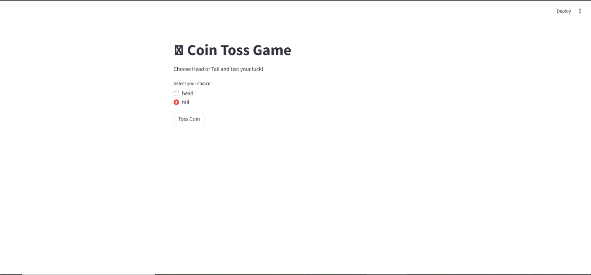
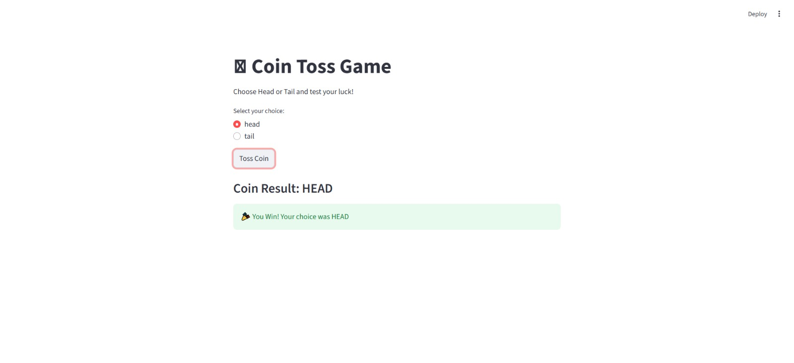

# 🪙 Coin Toss Game using NumPy & Streamlit

A simple and interactive Coin Toss Game built using **Python**, **NumPy**, and **Streamlit**.

Players can choose **Head** or **Tail**, toss the coin, and instantly see whether they won or lost. The game also includes a live scoreboard to track wins and losses.

---

## 🚀 Features

✅ Interactive Streamlit UI  
✅ Random coin toss using NumPy  
✅ Head/Tail selection  
✅ Real-time result display  
✅ Live Scoreboard  
✅ Reset Score functionality  
✅ Beginner-Friendly Project

---

## 🛠️ Technologies Used

- Python
- NumPy
- Streamlit

---

## 📂 Project Structure

```text
coin-toss-game/
│
├── app.py
├── requirements.txt
└── README.md
```

---

## 🎮 How to Run

### 1️⃣ Clone Repository

```bash
git clone https://github.com/your-username/coin-toss-game.git
```

### 2️⃣ Move to Project Folder

```bash
cd coin-toss-game
```

### 3️⃣ Install Dependencies

```bash
pip install -r requirements.txt
```

### 4️⃣ Run Application

```bash
streamlit run app.py
```

---

## 📸 Preview

### Main Screen

_Add a screenshot here_

```markdown

```

### Game Result

_Add a screenshot here_

```markdown

```

---

## 🧠 What I Learned

Through this project, I practiced:

- NumPy Arrays
- Random Number Generation
- Conditional Statements
- Loops
- Streamlit UI Development
- Session State Management
- Python Project Structure

---

## 🔮 Future Improvements

- Sound Effects
- Coin Flip Animation
- Multiplayer Mode
- Leaderboard
- Dark/Light Theme Toggle

---

## 👨‍💻 Author

**Hitesh Jadav**

Passionate about Data Science, Analytics, Python, and Machine Learning.

### Connect With Me

- GitHub: https://github.com/YOUR_GITHUB_USERNAME
- LinkedIn: https://linkedin.com/in/YOUR_LINKEDIN_PROFILE

---

⭐ If you like this project, consider giving it a star on GitHub!